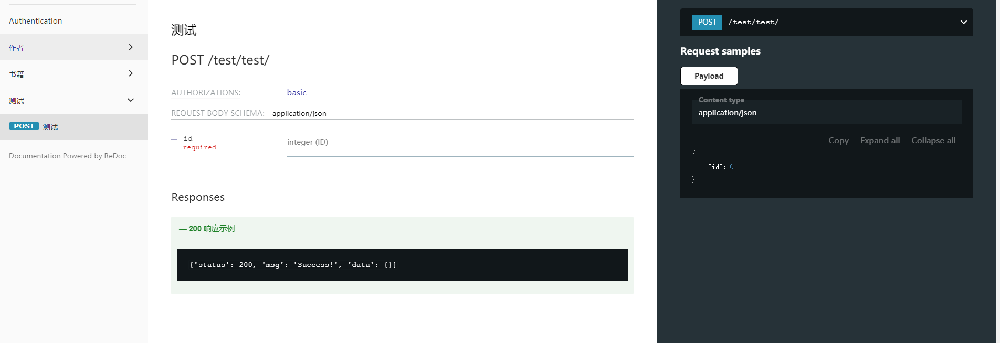

# django-project-example
## Django自用项目
### 1.djangorestframework+dry-yasg, 自动维护接口文档。
### 2.增加业务层
### 3.增加权限控制。

## 快速用法
#### 以 src.app.public 为例
#### -- models.py
```
from src.models import BaseModel, models, _


class BookModel(BaseModel):

    name = models.CharField(max_length=512, verbose_name=_('书名'), help_text=_('书名'))

    abstract = models.TextField(default=None, verbose_name=_('摘要'))
    pub_data = models.DateField(verbose_name='出版日期')

    @classmethod
    def _resource(cls):
        return 'books'

    def __str__(self):
        return self.name

    class Meta:
        verbose_name = _('书籍')
        db_table = 'test_books'
```
#### -- serializers.py
```
from src.lib.serializers import BaseSerializers, BaseInterfaceParams, params

class BookSerializers(BaseSerializers):
    class Meta(BaseSerializers.Meta):
        model = BookModel

# 定义查询参数 GET
class BookQueryParams(BaseInterfaceParams):
    name = params.CharField(max_length=1024, label=_('姓名'))

# 定义请求体参数 POST, PUT等
class BookBodyParams(BaseInterfaceParams):
    id = params.IntegerField(label=_('ID'), required=True)

```

#### -- resources.py
```
from src.lib.viewsets import BaseModelViewSets, ApiViewSets
from src.lib.controller import Controller
from src.dictionary import ResultCode as respCode
from .models import BookModel, _
from .serializers import BookSerializers


# 业务处理层
class BookStockOutController(Controller):
    def call(self, *args, **kwargs):
        return self.resp.success()
        
# 与Model相结合的ViewSet接口
class BooksViewSet(BaseModelViewSets):
    queryset = BookModel.objects.all()
    serializer_class = BookSerializers
    
    # 重写list, 添加查询参数 接口地址/books/
    @swagger_auto_schema(query_serializer=BookQueryParams)
    def list(self, request, *args, **kwargs):
        return super(BooksViewSet, self).list(request, *args, **kwargs)
    
    # 自定义接口 接口地址：/books/stock-out/
    # response_codes 定义错误代码集
    @swagger_auto_schema(
        operation_summary=_('下架'),
        operation_description="POST /books/stock-out/",
        request_body=BookBodyParams,
        response_codes=[respCode.C_50001, respCode.C_40001]
    )
    # 定义动作路径
    @action(detail=False, methods=['post'], url_path='stock-out')
    # 定义业务控制层
    @controller(controller_class=BookStockOutController, serializer_class=BookBodyParams)
    def stock_out(self, request, *args, **kwargs):
        pass
        
# 无Model的自定义接口
class TestViewSet(ApiViewSets):
    @swagger_auto_schema(
        operation_summary=_('测试'),
        operation_description="POST /test/test/",
        request_body=BookBodyParams,
        tags=['测试']
    )
    @action(detail=False, methods=['post'], url_path='test')
    def test(self, request, *args, **kwargs):
        pass
```
#### 如下图效果


